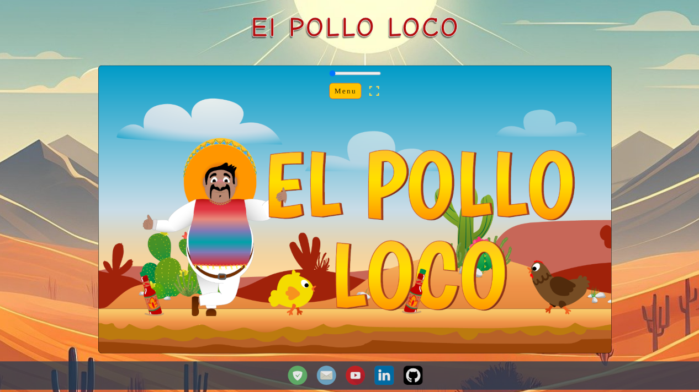

# 🐔 El Pollo Loco - Jump'n'Run Adventure

An action-packed 2D platformer featuring charming pixel-art characters, strategic boss battles, and responsive gameplay. Built with vanilla JavaScript following clean code principles and modern web standards.

---

## 🚀 Live Demo

🔗 [Live Demo – el-pollo-loco.dev2k.org](https://el-pollo-loco.dev2k.org/)

---

## 📸 Preview



---

## 🎮 Gameplay

Control **Pepe** through a desert world, collect coins & bottles, defeat chicken mobs, and challenge the final boss!

**Key Features:**

- 🕹️ Dynamic mechanics with jump/throw combos
- 🎭 5+ character animations (Idle, Jump, Hurt, Dead)
- 🐓 3 enemy types + unique boss behavior
- 📊 Interactive status bars for health/coins/ammo
- 🔊 Immersive SFX & background music
- 📱 Mobile touch controls with SVG icons
- 💾 Local storage for sound settings
- 🌐 PWA support with offline capabilities
- 🎨 Responsive design with orientation detection

---

## 🛠️ Technologies

- **Clean Code Architecture** with handler pattern for separation of concerns
- **Max 14 lines per function** following single responsibility principle
- **Arrow functions** with consistent coding conventions
- **Modular handler system** (Collision, Render, Throw, Heal, Alert)
- **OOP architecture** with class-based inheritance
- **Canvas-based rendering** with parallax scrolling
- **Modular audio system** with random sound pools
- **SVG icons** for modern UI elements
- **Device orientation detection** for mobile optimization
- **Progressive Web App (PWA)** ready
- **JSDoc documentation** for all classes and methods

---

## 🏗️ Architecture

### Handler Pattern

The game uses a **modular handler architecture** to separate concerns and improve maintainability:

- **CollisionHandler** - Manages all collision detection and physics interactions
- **RenderHandler** - Handles canvas rendering, parallax effects, and object drawing
- **ThrowHandler** - Controls bottle throwing mechanics and UI prompts
- **HealHandler** - Manages healing system and coin-to-health conversion
- **AlertHandler** - Controls enemy alert states and boss behavior

### Clean Code Principles

- ✅ **Single Responsibility** - Each class/handler has one clear purpose
- ✅ **Max 14 Lines** - All functions kept concise and readable
- ✅ **No Nested Functions** - Flat structure with extracted helpers
- ✅ **Arrow Functions** - Consistent ES6+ syntax (except constructors/event handlers)
- ✅ **DRY Principle** - Reusable helper methods extracted
- ✅ **Proper JSDoc** - Complete documentation for all public methods

---

## ▶️ Installation

1. Clone repository:

   ```bash
   git clone https://github.com/KosMaster87/El-pollo-loco
   ```

2. Open in browser:
   ```bash
   cd El-pollo-loco && open index.html
   ```
   Or use a local server:
   ```bash
   npx serve
   ```

---

## 📁 Project Structure

```text
el-pollo-loco/
├── assets/
│   ├── audio/                       # Sound effects & music
│   ├── fonts/
│   │   └── comic/                   # Custom webfonts (Creepster, Lexend)
│   ├── img/                         # Game sprites & backgrounds
│   │   ├── 2_character_pepe/
│   │   ├── 3_enemies_chicken/
│   │   ├── 4_enemie_boss_chicken/
│   │   ├── 5_background/
│   │   ├── 6_salsa_bottle/
│   │   ├── 7_statusbars/
│   │   ├── 8_coin/
│   │   ├── 9_intro_outro_screens/
│   │   └── 10_menu/
│   ├── social/                      # Social media icons (GitHub, LinkedIn, etc.)
│   ├── vector/
│   │   └── arrows/                  # SVG control icons
│   └── web-app/                     # PWA icons & manifest
│
├── js/
│   ├── game.js                      # Main game initialization
│   ├── global.js                    # Global variables & settings
│   ├── script.js                    # UI interactions & menu controls
│   ├── fullscreen.js                # Fullscreen API management
│   ├── display-handler.js           # Display & device detection
│   └── includeHTML.js               # Dynamic template loading
│
├── models/                          # Game object classes
│   ├── world.class.js               # Game world orchestration
│   ├── character.class.js           # Player character
│   │
│   ├── collision-handler.class.js   # Collision detection system
│   ├── render-handler.class.js      # Canvas rendering & drawing
│   ├── throw-handler.class.js       # Bottle throwing mechanics
│   ├── heal-handler.class.js        # Healing system
│   ├── alert-handler.class.js       # Enemy alert management
│   │
│   ├── enemy-endboss.class.js       # Final boss enemy
│   ├── enemy-chicken.class.js       # Normal chicken enemy
│   ├── enemy-chick.class.js         # Small chick enemy
│   ├── enemy-chicken_counterStrike_.class.js  # Boss spawned chickens
│   │
│   ├── object-drawable.class.js     # Base drawable object
│   ├── object-movable.class.js      # Base movable object with physics
│   ├── object-throwable.class.js    # Throwable bottle objects
│   ├── object-pickable.class.js     # Collectible items base
│   │
│   ├── map-background.class.js      # Background with parallax
│   ├── map-cloud.class.js           # Animated clouds
│   ├── map-bottle.class.js          # Collectible bottles
│   ├── map-coin.class.js            # Collectible coins
│   │
│   ├── status-bar-character.class.js
│   ├── status-bar-boss.class.js
│   ├── status-bar-coin.class.js
│   ├── status-bar-bottle.class.js
│   │
│   ├── audio-class.js               # Audio manager
│   ├── keyboard.class.js            # Input handling
│   ├── level.class.js               # Level structure
│   └── static.class.js              # Static assets manager
│
├── levels/
│   └── level1.js                    # Level configuration & enemies
│
├── templates/                       # HTML templates
│   ├── imprint.html
│   ├── settings.html
│   └── story.html
│
├── style/                           # Stylesheets
│   ├── style.css                    # Main styles & responsive design
│   ├── imprint.css
│   ├── settings.css
│   └── story.css
│
└── index.html                       # Entry point
```

---

## 🎮 Controls

### Desktop

- **Arrow Keys** / **A/D** - Move left/right
- **Space** - Jump
- **D** - Throw bottle
- **H** - Heal (when health pack available)

### Mobile

- **Touch controls** - On-screen buttons with SVG icons
- **Auto-rotation prompt** - For optimal landscape gameplay

---

## 🌐 PWA Features

- **Offline support** with service worker
- **Install prompt** for mobile & desktop
- **Responsive icons** (32px - 512px)
- **Manifest configuration** with theme colors
- **Optimized caching** strategy

---

## 🎨 Assets Attribution

- **Images:** [Pixabay](https://pixabay.com/)
- **Audio:** [Freesound](https://freesound.org/)
- **Fonts:** [Google Fonts](https://fonts.google.com/), [Google Webfonts Helper](https://gwfh.mranftl.com/fonts/)
- **Icons & Vectors:** [SVG Repo](https://www.svgrepo.com/), [FontAwesome](https://fontawesome.com/)

---

## 📝 License

This project is for educational purposes. All assets are attributed to their respective sources.

---

## 👨‍💻 Developer

**Konstantin Aksenov**
🔗 [GitHub](https://github.com/KosMaster87)
📧 [Konstantin.Aksenov@dev2k.org](mailto:Konstantin.Aksenov@dev2k.org)
